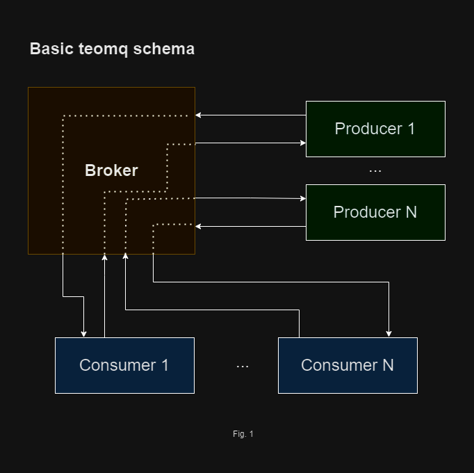

# Teonet messages queue

The Teonet messages queue is a part of the Teonet network.

## Basic teomq scheme

The Teonet messages queue contains three basic parts:

- Teonet messages broker
- Teonet messages consumer
- Teonet messages producer



### Broker

The Teonet messages Broker is responsible for sending and receiving messages
from the Teonet network. It wait connections from message Consumers and messages
Producers.

### Consumer

The Consumer connect to Broker and waits for messages from Broker.

### Producer

The message Producer sends messages to the Broker. Broker add messages to queue
and send it to first available Consumer.

The message Consumer process the message and send answer to Broker. The Broker
remove message from queue and resend answer to Producer.

The is one Broker and several Consumers and Producers.

### Basic teomq exsample

Start three aplication in three terminals.

First start the Broker:

```bash
# Start broker
go run ./cmd/broker/
```

When the Broker starts, it prints his teonet address in the console. This
address will be used in the next steps, when you start Consumers and Producers.

The string with address looks like this:

```bash
Connected to Teonet, this app address: og71X6Y8TU1Y2W4G9GkUsKmxnvvd9r2vXp2
```

Then start Consumer using Broker address:

```bash
# Start consumer
go run ./cmd/consumer/ -broker=og71X6Y8TU1Y2W4G9GkUsKmxnvvd9r2vXp2
```

Then start Producer using Broker address:

```bash
# Start producer
go run ./cmd/producer/ -broker=og71X6Y8TU1Y2W4G9GkUsKmxnvvd9r2vXp2
```

How this Basic teomq exsample works:

Producer sends messages to Broker. Broker prints messages in the console, save it to it's queue and resend it to the Consumer if Consumer is connected to Broker.

Consumer receives messages from Broker, prints them in the console and send it back to Broker. Broker resend this answers to Producer.

You can press Ctrl+C on Consumer terminal to stop the application. When Consumer will stoped, Broker will save messages to queue. When you start Consumer again, it will read messages from Brokers queue, process them and send answers.

## License

[BSD](LICENSE)
